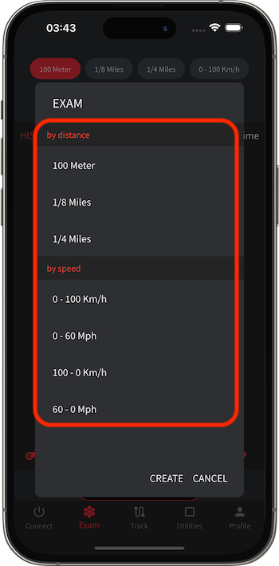
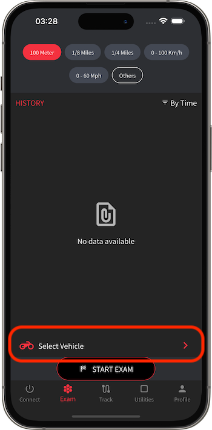
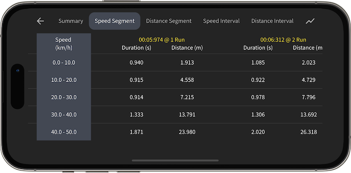
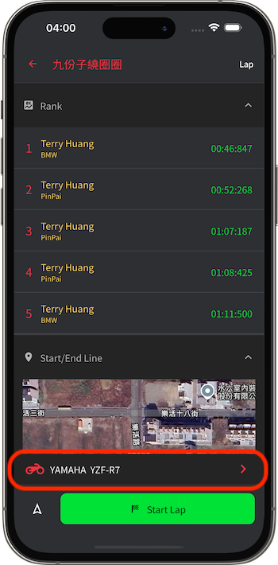
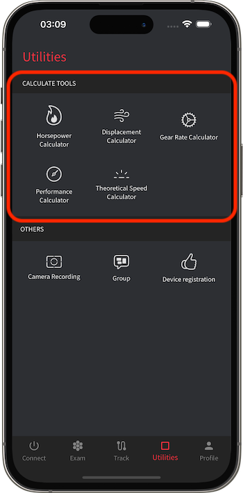
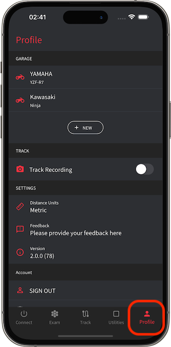

# K Race 使用說明 

[中文](https://koso-app.github.io/KOSO-Apps/krace2_how_to)|[English](https://koso-app.github.io/KOSO-Apps/krace2_how_to_en)|[日語](https://koso-app.github.io/KOSO-Apps/krace2_how_to_jp)

[服務條款](https://koso-app.github.io/KOSO-Apps/koso_service_terms_tw)|[隱私權聲明](https://koso-app.github.io/KOSO-Apps/policy)

**此 App 設計為賽道使用，請勿在一般道路上使用，並於使用時遵守安全規定。**

K Race 是一款能協助汽機車駕駛進行車輛調整的數據監視工具。藉由藍牙連接 Powertry 硬體裝置，可以相當有效率的監視行車數據。因為 Powertry 裝置內建了相當高效的GPS和陀螺儀模組，而能以相當高頻率的間隔來記錄資料，所以能提供非常精確有效的數值，相較於其他只使用手機GPS資料的App，其數據將準確許多。

在性能測試功能中，可以選擇速度或者距離測試。例如進行0-100 km/h加速時速測試或是400公尺的距離測試。藉由測試可以進一步了解目前車輛的性能和數據，並進一步將這些數據以分段圖表和曲線圖的方式展示，因此駕駛員可以方便地將這些資料相互比較並運用在性能調教上，並觀察其成果，K Race將會是執行效能調校的好工具。

## Powertry 硬體設備

1. 開關：透過長按開關來啟動和關閉Powertry
2. 充電介面：充電介面為micro USB介面
3. GPS訊號燈：當紅燈閃爍時，表示目前為接收到GPS訊號狀態
4. 電量指示燈：當充滿電時，電量指示燈為綠色，當低電量時，電量指示燈為紅色

## K Race App

### 連接頁面 (Connect Tab)

在「連接頁面」中，您可以控制/檢查 Powertry 裝置的連線狀態。

#### 連接 Powertry

在尚未連接 Powertry 的狀態下，請先將 Powertry 裝置開啟，然後再點擊畫面的連接按鈕，開始進行藍牙裝置掃描。當裝置出現在畫面中時，點擊該裝置進行連接。

> 硬體裝置名稱為 KOSO_XXXXXXXX（後方碼各自不同）。
>
> 手機需要啟用藍牙，並同意給予 App 「藍牙連線」、「位置服務」的權限。

 

### 測驗頁面 (Exam Tab)

在「測驗頁面」中，您可以進行性能測試。性能測試分成速度和距離測試項目，例如 0-100km/h 的加速度測試、50-0km/h 的減速度測試以及 1000m 距離測試等。

#### 選擇測驗類型

畫面上方為測驗類型的選擇區塊，若快取選項沒有預期的類型，可以選擇「其他」從清單中選取。

 

若清單中也沒有預期的類型，可以選擇建立新的測驗類型。

 

#### 選擇測驗車輛

畫面下方為測驗車輛的選擇按鈕，點擊後開啟清單選取。

 

若清單中也沒有預期的車輛，可以選擇建立新的車輛。

 

#### 性能測試歷史紀錄

您可以在畫面上方選擇測驗類型，該測驗類型的歷史數據會顯示在畫面中的清單。

點擊清單中的項目，便可以詳細觀看該測驗數據，有詳細的統計數字與圖表。

### 賽道頁面 (Track Tab)

在「賽道頁面」中，您可以進行賽道測試。賽道測試分成「起終點賽道」與「繞圈賽道」。

#### 選擇賽道

畫面上方切換為「賽道」分頁時，清單會顯示賽道清單，點擊選擇想要的賽道。

> 清單左上方元件可切換不同排序方式，清單右上方元件可進行關鍵字搜尋。
>
> 選擇賽道後，會出現該賽道的排行榜以及相關資訊。

 

若清單中也沒有預期的賽道，可以點擊右下方的按鈕建立新的賽道。

> 右上方元件可切換建立的賽道類型。

 

#### 選擇測驗車輛

選擇賽道後，畫面下方為測驗車輛的選擇按鈕，點擊後開啟清單選取。

若清單中也沒有預期的車輛，可以選擇建立新的車輛。

 

#### 賽道測試歷史紀錄

畫面上方切換為「歷史紀錄」分頁時，會顯示賽道測試歷史清單。

點擊清單中的項目，便可以詳細觀看該測驗數據，有詳細的統計數字與圖表。

### 工具頁面 (Utilities Tab)

在「工具頁面」中，您可以使用各式一次性工具。

#### 計算工具

在「計算工具」區塊，您可以使用各式效能計算機，包含馬力輸出計算機、排氣量計算機、齒輪比計算機、性能表現計算機。透過這些工具可以協助駕駛人或車輛工程師，在性能調教時提供有用的參考數據。

### 個人頁面 (Profile Tab)

在「個人頁面」中，您可以管理專屬於您的數據與設定。

#### 新增/維護車輛

在「車庫區塊」，您可以建立與維護車輛訊息，根據車輛數據不同，會影響實測測驗結果，例如輪馬力計算數據推估。車輛數據包含了車輛自訂名稱、車輛品牌、車輛型號、車輛排氣量(cc數)、總重量(車重+駕駛人重量)。

 

#### 變更全域設定

在「設定區塊」，您可以調整全域的設定，比如：切換使用的單位類型

#### 登入/登出雲端帳號

在「帳號區塊」，您可以選擇登入 Google/Apple/Email 來將資料儲存於雲端。

