# K Race User Guide

[中文](https://koso-app.github.io/KOSO-Apps/krace2_how_to)|[English](https://koso-app.github.io/KOSO-Apps/krace2_how_to_en)|[日本語](https://koso-app.github.io/KOSO-Apps/krace2_how_to_jp)

[Terms of Service](https://koso-app.github.io/KOSO-Apps/koso_service_terms_tw)|[Privacy Policy](https://koso-app.github.io/KOSO-Apps/policy)

**This app is designed for track use. Please do not use it on public roads and ensure safety precautions are followed during use.**

K Race is a data monitoring tool designed to assist vehicle drivers in performance adjustments. By connecting to the Powertry hardware device via Bluetooth, it efficiently monitors driving data. The Powertry device is equipped with a high-performance GPS and gyroscope module, enabling data recording at very high frequencies. This ensures highly accurate and effective data, making it far superior to apps that rely solely on mobile GPS data.

For performance testing, you can select speed or distance tests, such as 0-100 km/h acceleration or 400-meter distance tests. These tests provide detailed insights into the vehicle's performance and data, which are presented in segmented and curve charts. This makes it convenient for drivers to compare data, apply it to performance tuning, and observe results. K Race is an excellent tool for optimizing performance tuning.

## Powertry Hardware

1. **Power Button**: Long-press to turn the Powertry device on or off.
2. **Charging Port**: Micro USB interface for charging.
3. **GPS Signal Light**: A flashing red light indicates that GPS signal is not yet received.
4. **Battery Indicator**: Green light indicates full charge; red light indicates low battery.

## K Race App

### Connect Tab

On the "Connect Tab," you can control/check the connection status of the Powertry device.

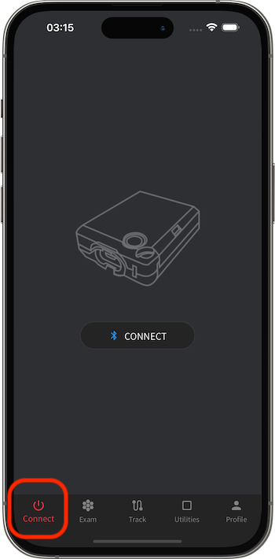

#### Connecting Powertry

If Powertry is not yet connected, turn it on and tap the connect button on the screen to start scanning for Bluetooth devices. When the device appears, tap it to connect.

> The hardware device is named KOSO_XXXXXXXX (with unique codes).
> 
> Ensure Bluetooth is enabled on your phone and grant the app permissions for "Bluetooth Connection" and "Location Services."

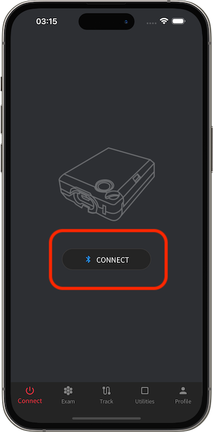 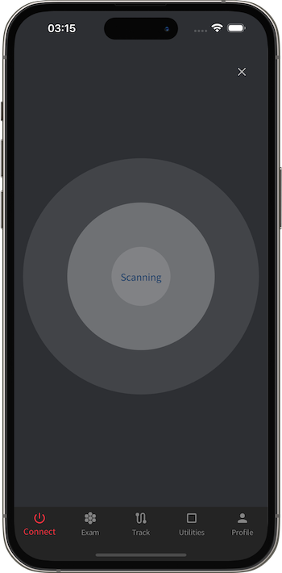

### Exam Tab

On the "Exam Tab," you can conduct performance tests, such as speed or distance-based tests like 0-100 km/h acceleration, 50-0 km/h deceleration, or 1000m distance tests.

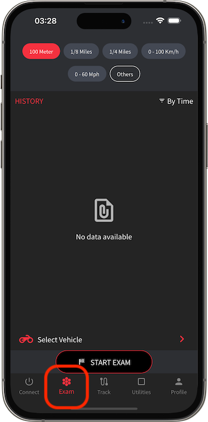

#### Selecting Test Type

The top section of the screen allows you to select the test type. If the cached options don't include the desired type, select "Other" to choose from a list.

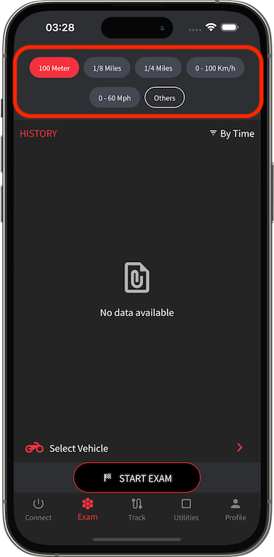 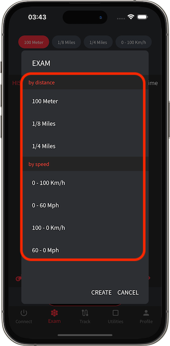

If the desired type isn't in the list, create a new test type.

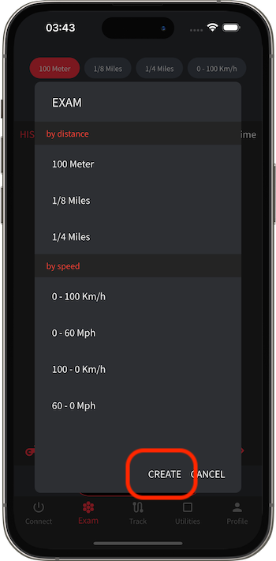 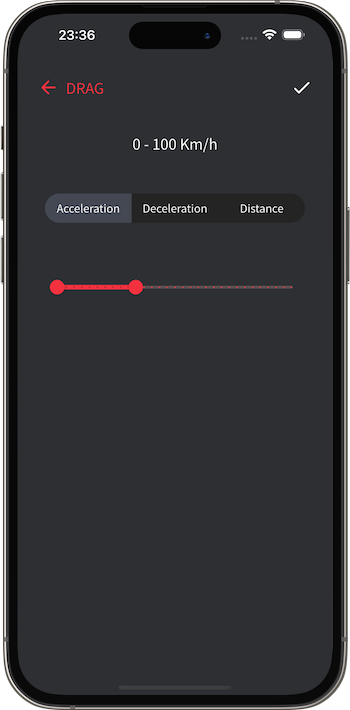

#### Selecting Test Vehicle

The bottom section of the screen contains buttons to choose the test vehicle. Tap to open the list for selection.

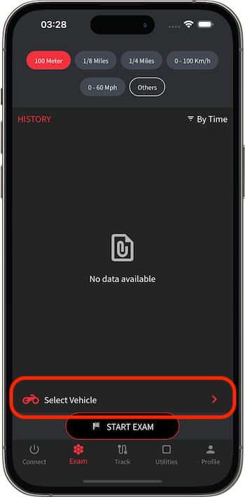 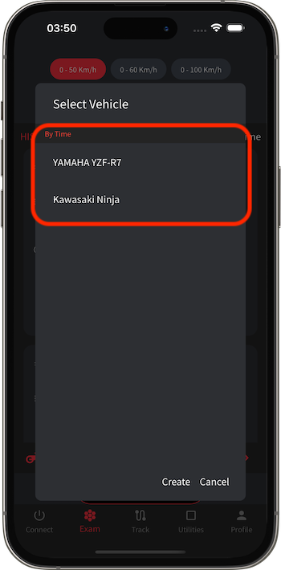

If the desired vehicle isn't in the list, create a new vehicle.

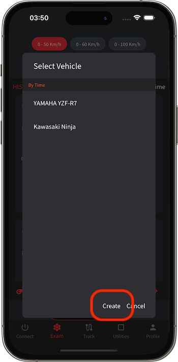 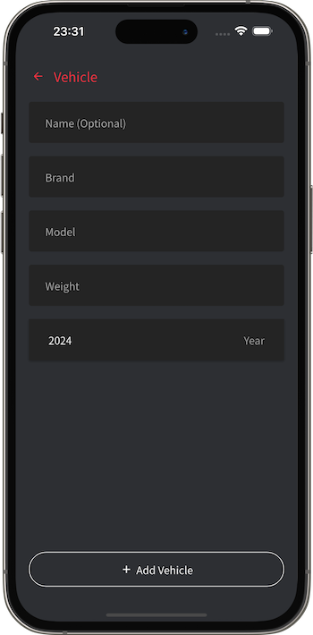

#### Performance Test History

Select the test type at the top of the screen to view the history of that test type in a list.

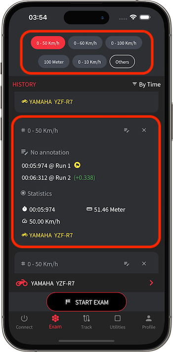

Tap an item in the list to view detailed test data, including statistics and charts.

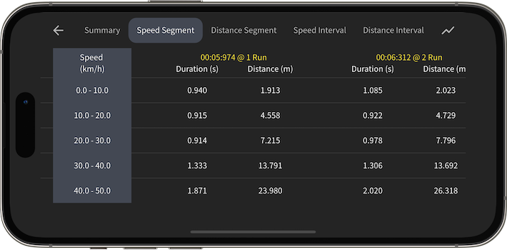

### Track Tab

On the "Track Tab," you can conduct track tests, categorized into "Start-Finish Tracks" and "Circuit Tracks."

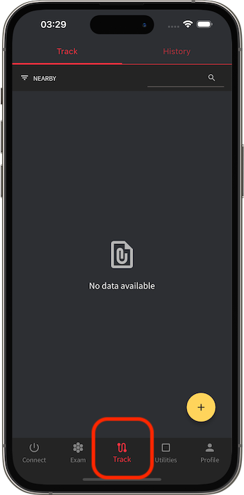

#### Selecting Track

Switch to the "Track" tab at the top of the screen to view a list of tracks. Tap to select a track.

> The list can be sorted using the top-left component or searched using the top-right component.
> 
> After selecting a track, its leaderboard and related information will be displayed.

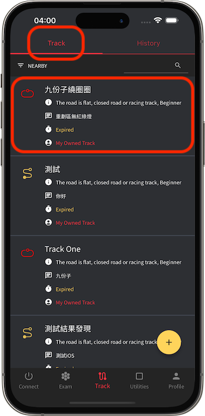 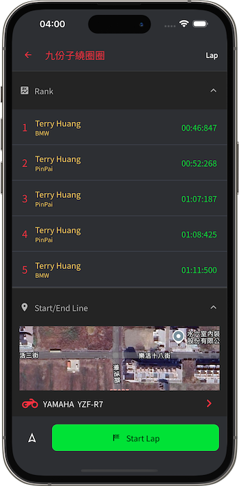

If the desired track isn't in the list, tap the button in the bottom-right to create a new track.

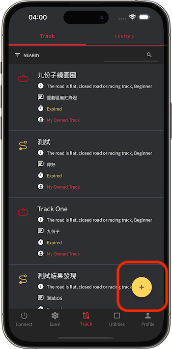 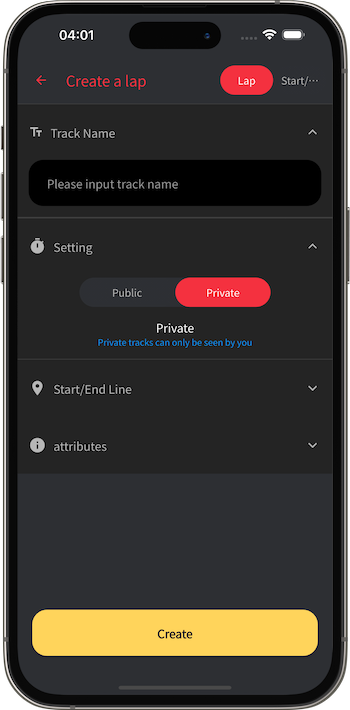

#### Selecting Test Vehicle

After selecting a track, the bottom section of the screen contains buttons to choose the test vehicle. Tap to open the list for selection.

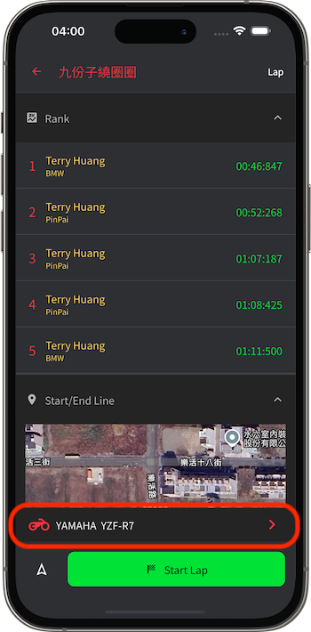 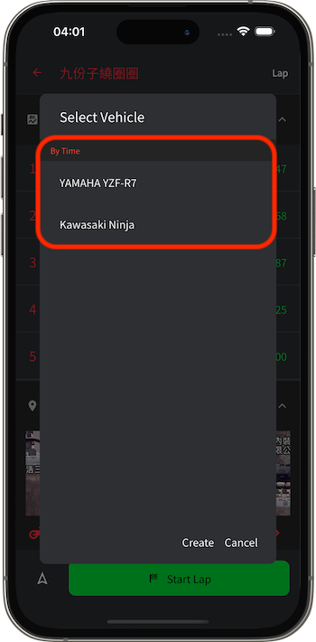

If the desired vehicle isn't in the list, create a new vehicle.

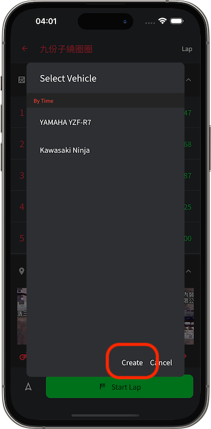 

#### Track Test History

Switch to the "History" tab at the top of the screen to view the history of track tests.

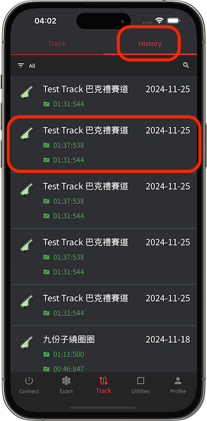

Tap an item in the list to view detailed test data, including statistics and charts.

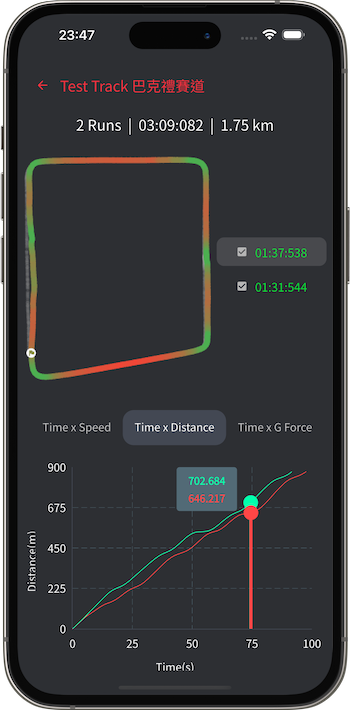

### Utilities Tab

On the "Utilities Tab," you can access various one-time tools.

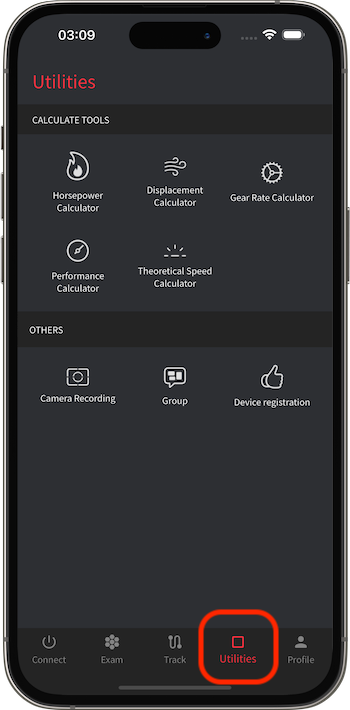

#### Calculation Tools

In the "Calculation Tools" section, you can use performance calculators, including horsepower calculators, displacement calculators, gear ratio calculators, and performance calculators. These tools assist drivers and vehicle engineers by providing valuable reference data for performance tuning.

### Profile Tab

On the "Profile Tab," you can manage your personal data and settings.

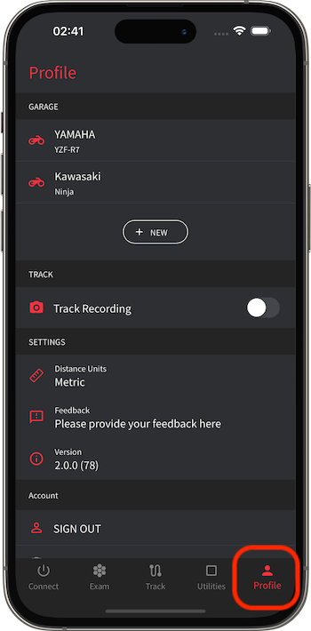

#### Adding/Maintaining Vehicles

In the "Garage" section, you can add and maintain vehicle information. Vehicle data, such as custom names, brands, models, displacement (cc), and total weight (vehicle + driver), affects test results, such as wheel horsepower calculations.

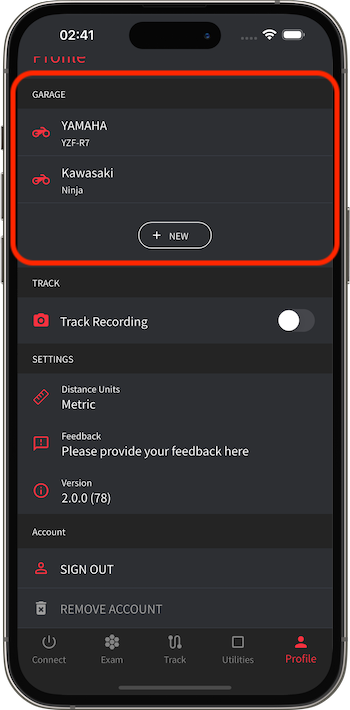 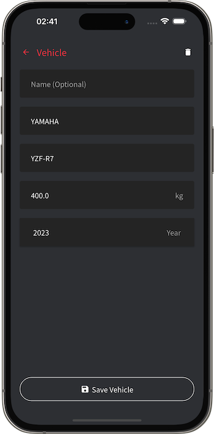

#### Changing Global Settings

In the "Settings" section, you can adjust global settings, such as switching unit types.

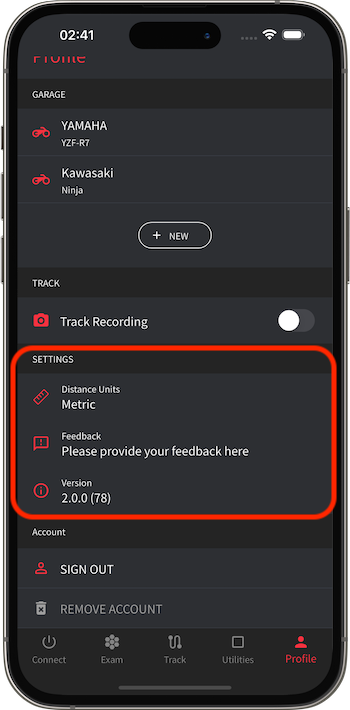

#### Logging In/Out of Cloud Accounts

In the "Account" section, you can log in using Google, Apple, or Email to save data in the cloud.

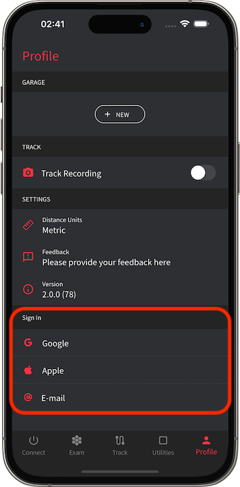
