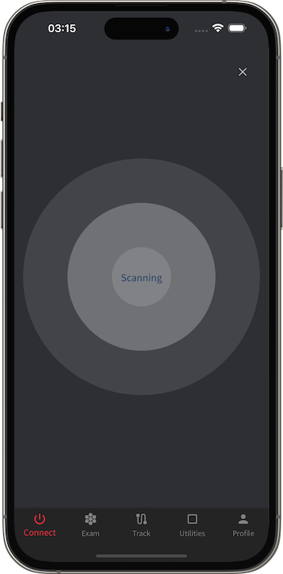
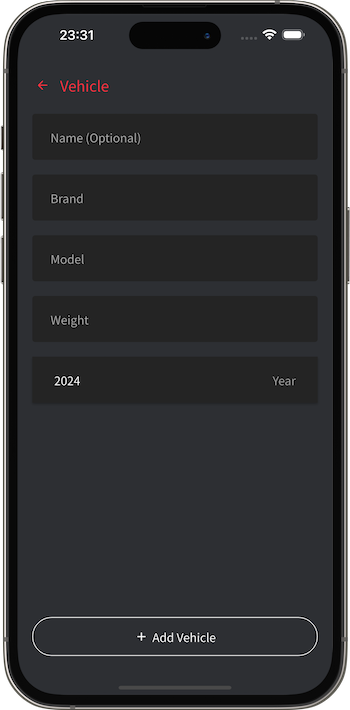
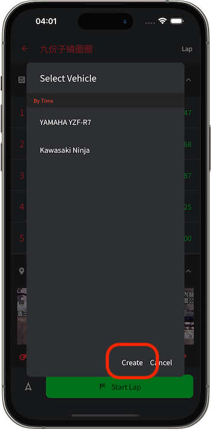

# K Race 使用方法

[中文](https://koso-app.github.io/KOSO-Apps/krace2_how_to)|[English](https://koso-app.github.io/KOSO-Apps/krace2_how_to_en)|[日本語](https://koso-app.github.io/KOSO-Apps/krace2_how_to_jp)

[利用規約](https://koso-app.github.io/KOSO-Apps/koso_service_terms_tw)|[プライバシーポリシー](https://koso-app.github.io/KOSO-Apps/policy)

**本アプリはサーキットでの使用を目的として設計されています。一般道では使用せず、安全規則を遵守してください。**

K Race は、車両の調整を支援するデータモニタリングツールです。Bluetoothを介してPowertryハードウェアデバイスと接続することで、効率的に走行データを監視できます。Powertryデバイスには高性能GPSとジャイロモジュールが内蔵されており、高頻度でデータを記録できます。そのため、スマートフォンGPSデータのみを使用するアプリと比較して、非常に正確なデータを提供します。

性能テスト機能では、速度または距離のテストを選択できます。たとえば、0-100 km/hの加速テストや400メートルの距離テストを行うことが可能です。これにより、現在の車両の性能やデータをさらに理解し、それらのデータを分割グラフや曲線グラフで表示します。ドライバーはこれらのデータを比較し、性能調整に活用できます。K Raceは、性能調整における優れたツールです。

## Powertry ハードウェア

1. **電源ボタン**: 長押しでPowertryをオン/オフします。
2. **充電インターフェース**: Micro USBインターフェースを使用。
3. **GPS信号ランプ**: 赤いランプが点滅している場合、GPS信号を受信していません。
4. **バッテリーインジケーター**: 緑色は満充電、赤色は低バッテリー状態を示します。
5. 

## K Race アプリ

### 接続ページ (Connect Tab)

「接続ページ」では、Powertryデバイスの接続状態を管理/確認できます。

#### Powertryに接続する

Powertryが未接続の場合、まずデバイスをオンにしてから、画面の接続ボタンをタップしてBluetoothスキャンを開始します。画面にデバイスが表示されたら、それをタップして接続してください。

> ハードウェアデバイスの名前は「KOSO_XXXXXXXX」（末尾コードは異なります）。
>
> スマートフォンのBluetoothを有効にし、アプリに「Bluetooth接続」「位置情報サービス」の許可を与えてください。

 

### テストページ (Exam Tab)

「テストページ」では、性能テストを実施できます。性能テストには、速度テストと距離テストがあります。たとえば、0-100km/hの加速テストや、50-0km/hの減速テスト、1000m距離テストなどがあります。

#### テストタイプの選択

画面上部にテストタイプ選択セクションがあります。キャッシュオプションに希望するタイプがない場合、「その他」を選択してリストから選べます。

 

リストに希望するタイプがない場合、新しいテストタイプを作成することも可能です。

 

#### テスト車両の選択

画面下部にテスト車両選択ボタンがあります。タップしてリストを開きます。

 

リストに希望する車両がない場合、新しい車両を作成することも可能です。

 

#### 性能テスト履歴

画面上部でテストタイプを選択すると、そのタイプの履歴データがリストに表示されます。

リストの項目をタップすると、詳細なテストデータが表示され、統計数値やグラフが確認できます。

### サーキットページ (Track Tab)

「サーキットページ」では、サーキットテストを実施できます。サーキットテストには「スタート/ゴールトラック」と「周回トラック」の2種類があります。

#### サーキットの選択

画面上部で「サーキット」タブに切り替えると、サーキットリストが表示されます。選択したいサーキットをクリックします。

> リストの左上には異なるソート方法を切り替えるボタンがあり、右上にはキーワード検索機能があります。
>
> サーキットを選択すると、そのサーキットのランキングや関連情報が表示されます。

 

リストに希望するサーキットがない場合、右下のボタンをクリックして新しいサーキットを作成します。

 

#### テスト車両の選択

サーキットを選択した後、画面下部でテスト車両選択ボタンをタップしてリストを開きます。

 

リストに希望する車両がない場合、新しい車両を作成することも可能です。

 

#### サーキットテスト履歴

画面上部で「履歴」タブに切り替えると、サーキットテスト履歴リストが表示されます。

リストの項目をタップすると、詳細なテストデータが表示され、統計数値やグラフが確認できます。

### ユーティリティページ (Utilities Tab)

「ユーティリティページ」では、さまざまな便利なツールを利用できます。

#### 計算ツール

「計算ツール」セクションでは、さまざまな性能計算機を使用できます。たとえば、馬力出力計算機、排気量計算機、ギア比計算機、性能評価計算機があります。これらのツールは、ドライバーや車両エンジニアが性能調整を行う際に役立つ参考データを提供します。

### プロファイルページ (Profile Tab)

「プロファイルページ」では、自分専用のデータや設定を管理できます。

#### 車両の追加/メンテナンス

「ガレージ」セクションでは、車両情報を作成および管理できます。車両データは実測テスト結果に影響します（たとえば、ホイール出力の計算など）。車両データには、カスタム名称、ブランド、モデル、排気量（cc）、総重量（車両重量+ドライバー重量）が含まれます。

 

#### 全般設定の変更

「設定」セクションでは、単位の種類など、全般設定を調整できます。

#### クラウドアカウントのログイン/ログアウト

「アカウント」セクションでは、Google/Apple/Emailを使用してクラウドにデータを保存することができます。

