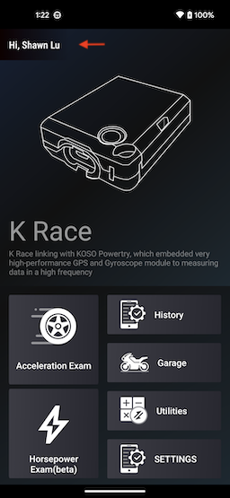
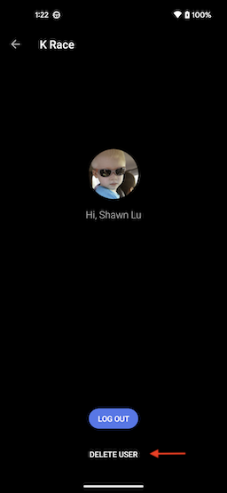

# Delete K Race Account

[中文](https://koso-app.github.io/KOSO-Apps/krace_delete_account)|[English](https://koso-app.github.io/KOSO-Apps/krace_delete_account_en)|[日語](https://koso-app.github.io/KOSO-Apps/krace_delete_account_jp)

To delete your K Race account, you can go to the user page within the app and choose the option to delete the account to remove all related data settings.

|          |                       |
| ---------------------------------------------- | ----------------------------------------------------------- |
| Click on the username to access the user page. | Click on『Delete user』button to delete your K Race account |

If you encounter any issues regarding account deletion or any other problems, please contact us via the following email: [koso6565@gmail.com](mailto:koso6565@gmail.com).

